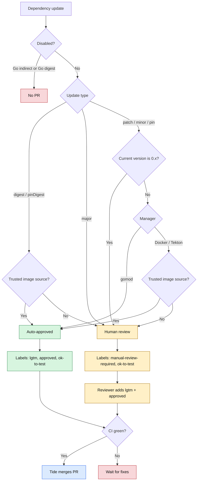

# HyperFleet Renovate configuration

This repository is the shared [Renovate](https://docs.renovatebot.com/) policy for the `openshift-hyperfleet` organization. It gives repositories a consistent update schedule, Go module hygiene, risk-tiered labels, and predictable dependency grouping.

## Use the preset

After this repository is created in the organization, a consumer extends the default preset from its root `renovate.json`:

```json
{
  "$schema": "https://docs.renovatebot.com/renovate-schema.json",
  "extends": ["github>openshift-hyperfleet/renovate-config"]
}
```

`default.json` is Renovate's conventional organization preset. Do not append `:main`: Renovate interprets a colon suffix as a preset filename, not a Git branch.

Consumer configuration is merged after the shared preset. Add only genuinely repository-specific rules in a consumer, and keep narrower matching rules after its `extends` declaration.

## Policy

| Update class | Labels | Merge behavior |
| --- | --- | --- |
| Go patch, minor, and pin (non-0.x) | `lgtm`, `approved`, `ok-to-test` | Tide after CI |
| Go 0.x patch, minor, or pin | `manual-review-required`, `ok-to-test` | Tide after human `/lgtm` and CI |
| Go major | `manual-review-required`, `ok-to-test` | Tide after human `/lgtm` and CI |
| Trusted Red Hat or Konflux Docker patch, minor, or pin (non-0.x) | `lgtm`, `approved`, `ok-to-test` | Tide after CI |
| Trusted Red Hat or Konflux Docker 0.x patch, minor, or pin | `manual-review-required`, `ok-to-test` | Tide after human `/lgtm` and CI |
| Third-party Docker patch, minor, or pin | `manual-review-required`, `ok-to-test` | Tide after human `/lgtm` and CI |
| Trusted Red Hat or Konflux Docker digest | `lgtm`, `approved`, `ok-to-test` | Tide after CI |
| Third-party Docker digest or major image | `manual-review-required`, `ok-to-test` | Tide after human `/lgtm` and CI |
| Non-major Konflux/Tekton docker or annotation reference (non-0.x) | `lgtm`, `approved`, `ok-to-test` | Tide after CI |
| Konflux/Tekton 0.x reference or third-party version, digest, or major | `manual-review-required`, `ok-to-test` | Tide after human `/lgtm` and CI |

The shared preset creates and updates branches only on Monday between 00:00 and 03:59 UTC (`updateNotScheduled: false`). It disables Go indirect-dependency updates, applies strict Go-version compatibility filtering, and scans `.tekton/**/*.yaml` for Tekton references. Major Go upgrades run `gomodUpdateImportPaths` before `gomodTidy`, so module-path and checksum changes are generated together.

Renovate automerge is disabled for every rule. The labels express update eligibility for Tide: trusted non-major updates can merge after CI, while `manual-review-required` updates still need a human `/lgtm` even when CI is green.

`packageRules` and `addLabels` merge with inherited MintMaker org config. Renovate does not remove labels added by a broader inherited rule, so any org-level auto-approve rule must itself exclude third-party sources and `0.x` updates. Validate the effective config in MintMaker before rollout.

## Update decision flow



`APPROVE` = `lgtm`, `approved`, `ok-to-test`. `HUMAN` = `manual-review-required`, `ok-to-test`.

Non-major flow is sequential: check `0.x` first, then manager type. Go modules skip the trusted-source check. Docker and Tekton non-0.x updates still require a trusted Red Hat/Konflux source to auto-approve.

## Go module behavior

```text
patch/minor/pin (non-0.x) → approve
0.x patch/minor/pin     → human
major                   → human
indirect                → disabled
digest                  → disabled
Go-incompatible         → filtered out
import migration  → automatic
go mod tidy       → automatic
```

## Local validation

Install hooks once:

```sh
make install-hooks
```

Run the repository check directly:

```sh
make validate
```

The pre-commit hook runs `make validate` whenever `default.json` changes, alongside secret scanning, JSON validation, and file-hygiene checks. MintMaker updates the pinned Renovate validator version in `Makefile` via `renovate.json`. This repository intentionally does not use a GitHub Actions workflow.

## Rollout and rollback

Create and protect this repository before modifying consumers. Migrate one repository at a time and use a `renovate/reconfigure` PR to prove that MintMaker can resolve the remote preset.

If a consumer regresses, restore its previous standalone `renovate.json`. Do not delete or rename this repository while any consumer extends it.

Prow removes `lgtm` after a branch synchronization. MintMaker currently does not restore it after a rebase or regenerated update, so a trusted reviewer must reissue `/lgtm` until the separate trusted-app sticky-LGTM enhancement is available.
